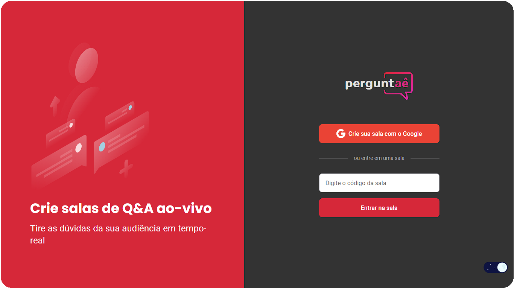

<p align="center">
  
</p>

<p align="center">
	  
	  
	  
	  
	  <a href="https://letmeask-4eb9f.web.app">
			
    </a>
</p>

<p align="center">
  
</p>

Generate Q&A rooms and answer the right questions. Perguntaê makes it easier to connect with your audience. In real time.

## Technologies

- [React](https://reactjs.org)
- [Styled components](https://styled-components.com/)
- [Firebase](https://firebase.google.com/)
- [TypeScript](https://www.typescriptlang.org/)

## Contributing

1. Fork it (<https://github.com/mpirescarvalho/perguntae/fork>)
2. Create your feature branch (`git checkout -b feature/awesome`)
3. Commit your changes (`git commit -am 'Add awesome feature'`)
4. Push to the branch (`git push origin feature/awesome`)
5. Create a new Pull Request

## Building

You'll need [Node.js](https://nodejs.org) installed on your computer in order to build this app.

Clone the repository:

```bash
$ git clone https://github.com/mpirescarvalho/perguntae.git
$ cd perguntae
```

Setup a [Firebase](https://firebase.google.com/) account and project. Next, fill up the environment variables using _.env.template_ as an example.

Now you can proceed to run the project:

```bash
$ npm install
$ npm run start
```

Runs the app in the development mode.<br/>

## Contact

<a href="https://github.com/mpirescarvalho">
  
</a>
<a href="mailto:mpirescarvalho17@gmail.com">
  
</a>

_Project developed in the **[Next Level Week Together](https://nextlevelweek.com/)**._
